# Match-Meal Client Service 🎨

Match-Meal 프로젝트의 프론트엔드 레포지토리입니다.
Vue 3와 TypeScript를 기반으로 개발되었으며, 사용자 친화적인 UI/UX를 통해 식단 관리 및 AI 피드백 서비스를 제공합니다.

## 🛠 Tech Stack

### Framework & Core

* **Vue 3**: Composition API (`<script setup>`) 방식 사용.
* **TypeScript**: 정적 타입을 통한 안정적인 개발 환경.
* **Vite**: 빠른 빌드 및 개발 서버 구동.

### State Management & API

* **Pinia**: 전역 상태 관리 (User Auth, Diet Data 등).
* **Axios**: HTTP Client (Interceptors를 통한 JWT 토큰 자동 주입).

### Styling & UI

* **Tailwind CSS**: 유틸리티 퍼스트 CSS 프레임워크.
* **Lucide Vue**: 아이콘 라이브러리.
* **Chart.js**: 영양 성분 통계 시각화.

### Environment

* **Node.js**: 18+ (Recommended)
* **pnpm** or **npm**

---

## 🏗 Client Architecture

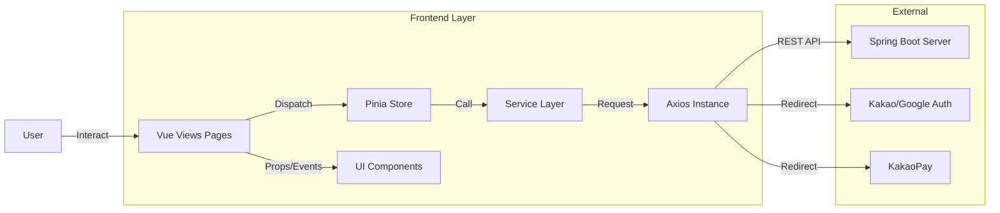

---

## 💡 Key Features

### 1. 인증 및 사용자 (Auth & User)

<p align="center">
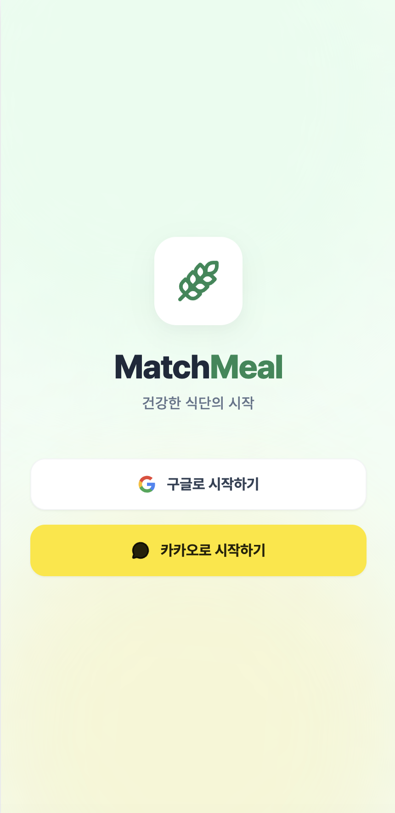
</p>

* **소셜 로그인**: 카카오/구글 로그인 (백엔드 리다이렉트 방식 연동).
* **토큰 관리**: `Access Token`은 Pinia/LocalStorage 저장, `Refresh Token`은 HttpOnly Cookie로 관리.
* **Axios Interceptor**: API 요청 시 자동으로 토큰 헤더(`Authorization`) 추가 및 401 에러 시 토큰 갱신 로직 수행.

### 2. 식단 기록 및 시각화 (Diet Management)

<p align="center">
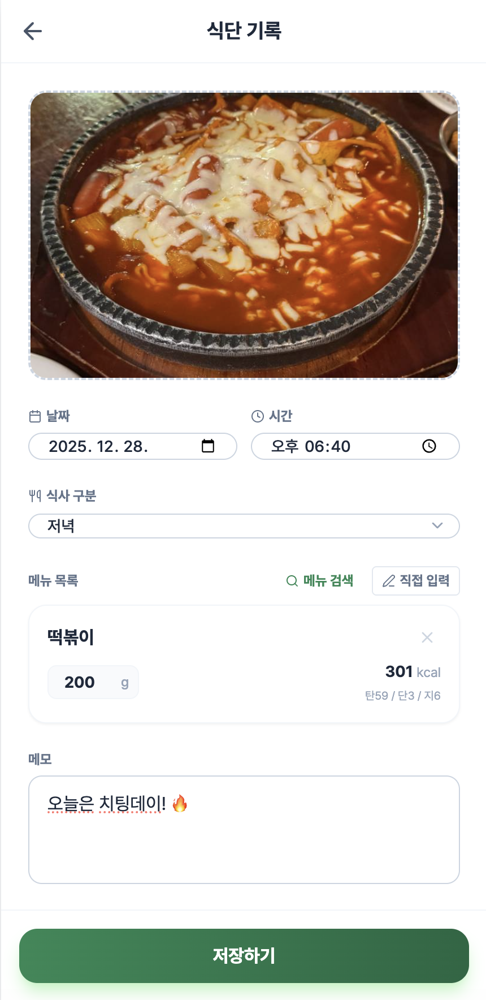
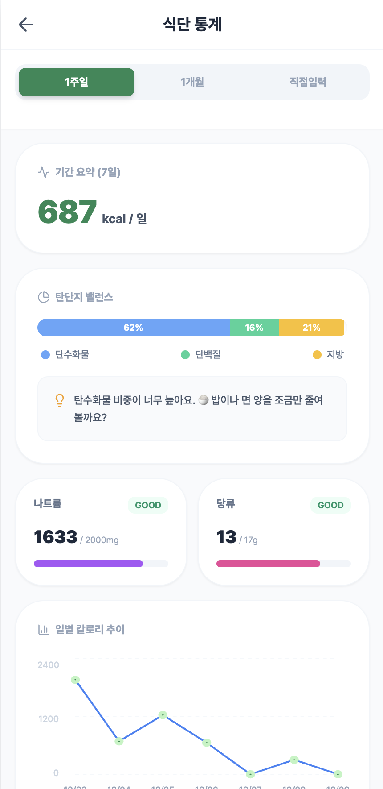
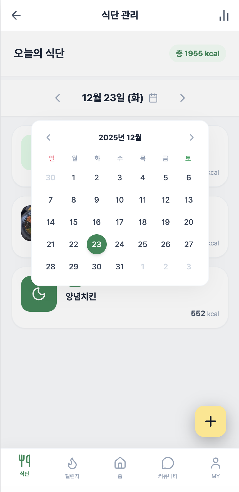
</p>

* **이미지 업로드**: `FormData`를 사용하여 식단 이미지 및 메타데이터 전송.
* **통계 차트**: Chart.js를 활용하여 탄/단/지/당/나 영양소 섭취 비율을 그래프로 시각화.
* **캘린더 뷰**: 날짜별 식단 기록 조회 및 이동.

### 3. AI 챗봇 및 피드백 (AI Service)

<p align="center">
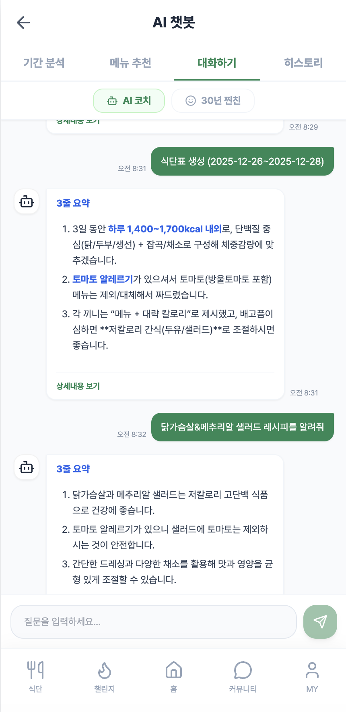
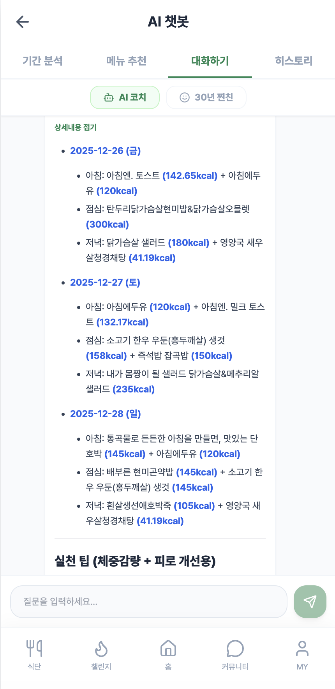
</p>

* **채팅 인터페이스**: AI 영양사와의 실시간 대화 UI 구현.

### 4. 커뮤니티 (Community)

<p align="center">
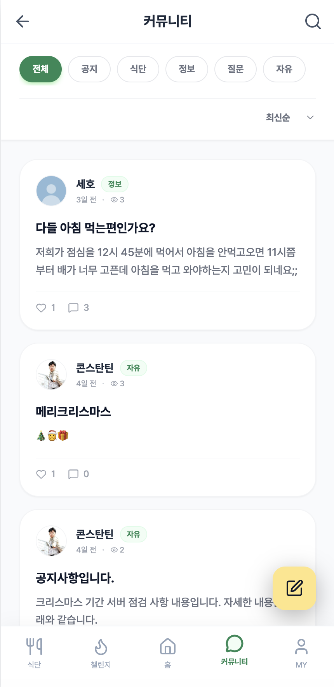
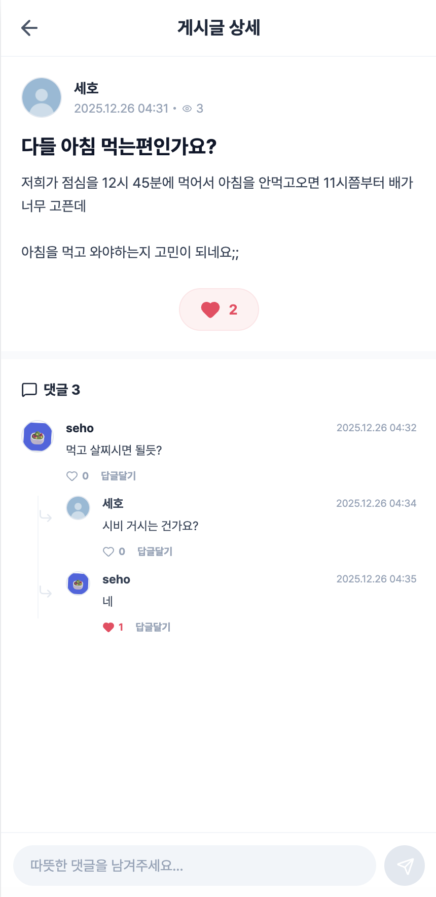
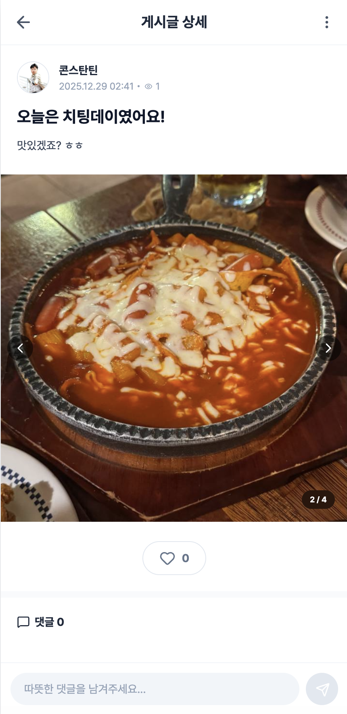
</p>

- **피드형 게시판**: 사용자들의 식단 공유 및 소통 (이미지/동영상 최대 5장 업로드 지원).
- **소셜 기능**: 게시글 좋아요, 댓글/대댓글 작성, 조회수 집계.
- **캐러셀 UI**: Swiper 등을 활용한 다중 미디어 슬라이드 뷰 구현.

### 5. 챌린지 (Challenge)

<p align="center">
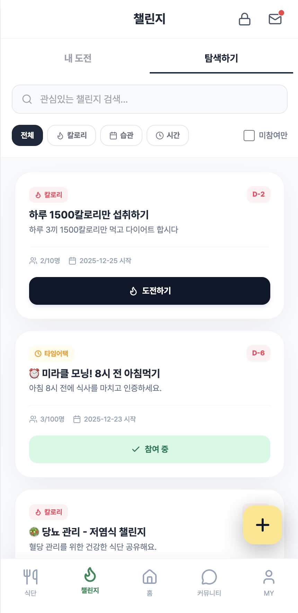
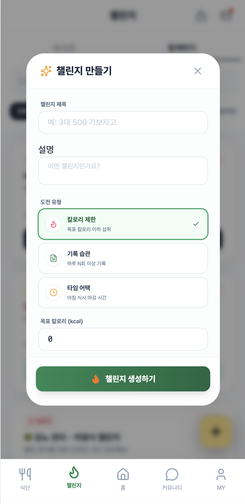
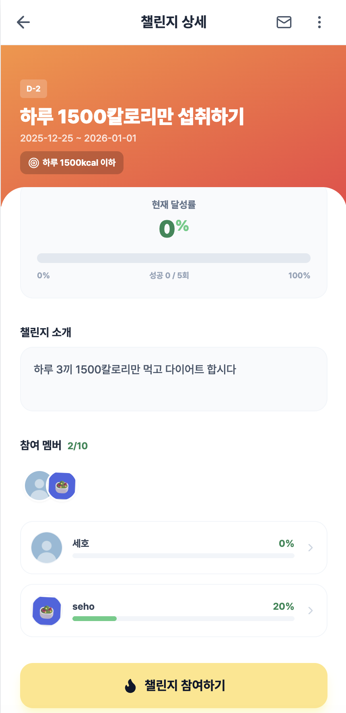
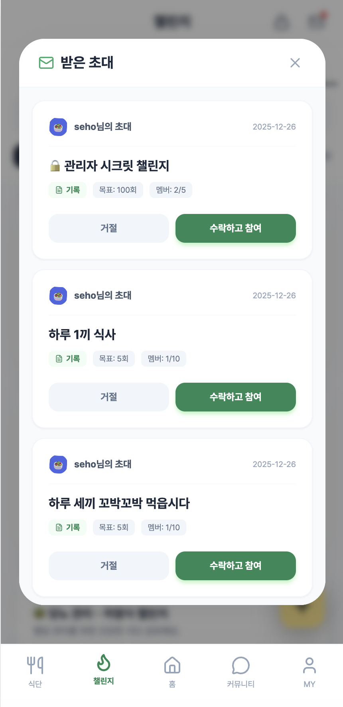
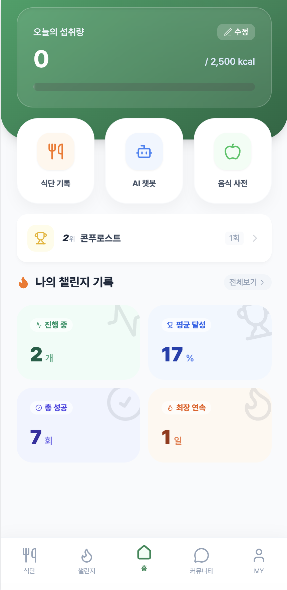
</p>

- **챌린지 카드 UI**: 진행 중/모집 중인 챌린지 목록을 카드 형태로 시각화.
- **초대 시스템**: 모달(InviteModal)을 통해 초대 코드를 입력하거나 친구를 그룹에 초대하는 기능.
- **목표 관리**: 챌린지 생성 폼(기간, 목표 설정) 제공 및 상세 페이지에서의 진행률 대시보드.

### 6. 멤버십 구독 (Payment)

<p align="center">
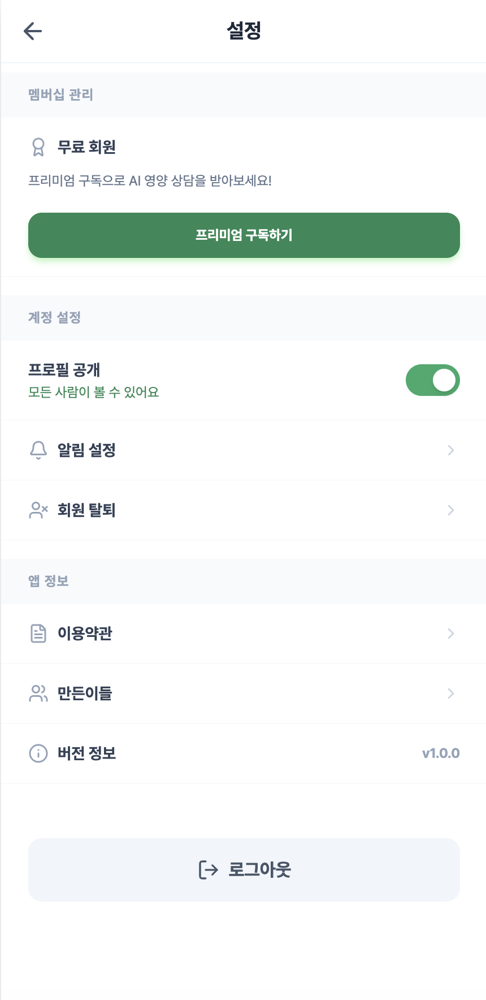
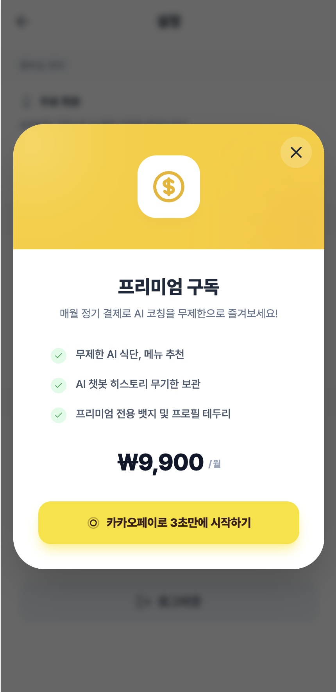
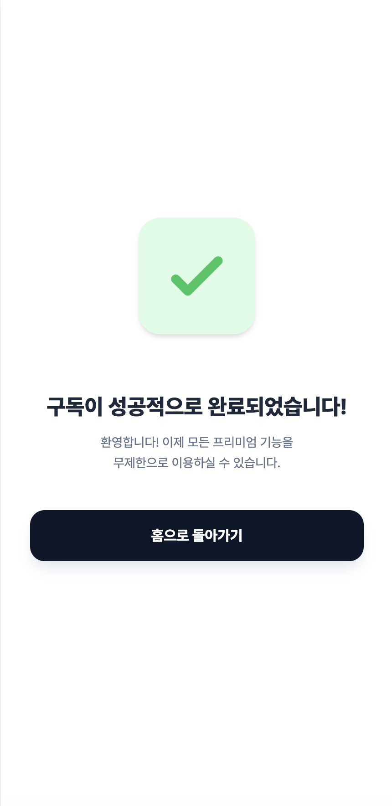
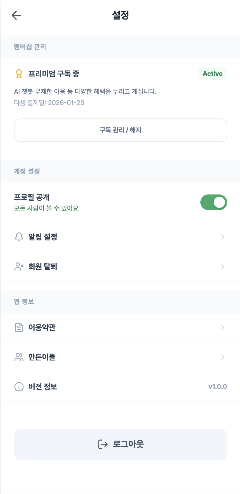
</p>

* **카카오페이 연동**: 결제 준비 -> 결제 승인 프로세스 UI 처리.
* **로딩 상태 처리**: 결제 진행 중 스피너 등을 통한 UX 처리.

---

## 📂 Project Structure

```text
src/
├── assets/             # 정적 리소스 (CSS, Images)
├── components/         # 재사용 가능한 UI 컴포넌트
│   ├── ai/             # AI 기능 관련 모달 (식단 계획 등)
│   ├── common/         # 공통 컴포넌트 (네비게이션, 알림, 모달, 토스트)
│   ├── home/           # 홈 화면 관련 (랭킹 티커/모달)
│   ├── payment/        # 결제/구독 관련 모달
│   └── settings/       # 설정 관련 모달
├── router/             # Vue Router 라우팅 설정 (페이지 이동 관리)
├── services/           # API 통신 로직 (Axios Client & Service Layer)
├── stores/             # Pinia 전역 상태 관리 (Auth, Diet, Notification 등)
├── utils/              # 유틸리티 함수 (로컬 스토리지 관리 등)
├── views/              # 페이지 단위 컴포넌트 (View)
│   ├── payment/        # 결제 성공 및 구독 페이지
│   └── ...             # 각 기능별 메인 페이지 (로그인, 식단, 커뮤니티, 챌린지, 프로필 등)
├── App.vue             # 루트 컴포넌트
└── main.ts             # 애플리케이션 진입점

```

---

## 🚀 Getting Started

### Prerequisites

* Node.js (v18 이상 권장)
* Backend Server (Spring Boot) 실행 중일 것 (Default Port: `8080`)

### Configuration (`vite.config.ts`)

이 프로젝트는 개발 환경에서 **Vite Proxy**를 사용하여 CORS 문제를 해결하고 API 요청을 백엔드로 전달합니다.
별도의 `.env` 설정 없이, `/api` 경로로 요청하면 자동으로 `http://localhost:8080`으로 연결됩니다.

```typescript
// vite.config.ts
proxy: {
  '/api': {
    target: 'http://localhost:8080',
    changeOrigin: true,
    rewrite: (path) => path.replace(/^\/api/, ''),
  },
}

```

### Installation & Run

```bash
# 1. 의존성 설치
npm install
# or
yarn install

# 2. 개발 서버 실행
npm run dev
# or
yarn dev

```

### Build for Production

```bash
# 프로덕션 빌드 (dist 폴더 생성)
npm run build
```
